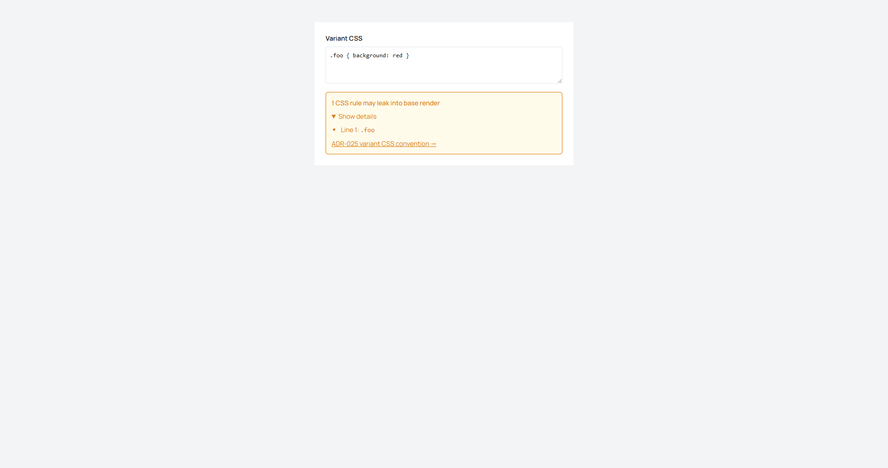
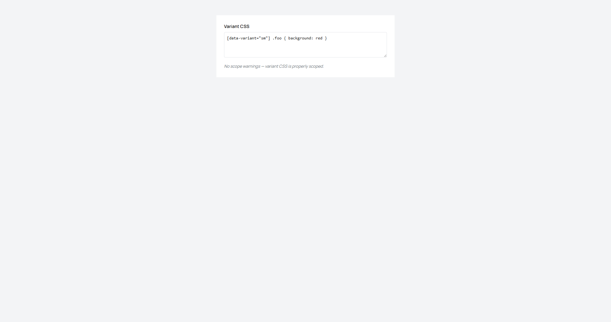

# WP-029 Phase 1: Variant CSS scoping validator (Task A)

> Workplan: WP-029 Heuristic polish — Tasks A+B (OQ4 validator + OQ6 App render pins)
> Phase: 1 of 4
> Priority: P1 — Plumbing hygiene; preventative, not user-blocking
> Estimated: 3.5h (helper 30min + unit tests 40min + inline banner JSX 30min + integration + debounce 40min + RTL append 30min + visual check 20min + manifest + gates + result log 30min)
> Type: Frontend (Studio) + tests
> Previous: Phase 0 ✅ RECON — 8 carry-overs locked, 1 OQ resolved (--status-warn-* token use), 1 OQ acknowledged (filename VariantsDrawer.tsx::VariantEditorPanel)
> Next: Phase 2 — Task B `<App />` render-level regression pins (block-forge)
> Affected domains: studio-blocks

---

## Inputs

- **`logs/wp-029/phase-0-result.md`** (commit `302b6908`) — authoritative carry-over registry. Phase 1 consumes (a)/(b)/(c)/(h); (d)/(e)/(f) belong to Phase 2.
- **`workplan/WP-029-heuristic-polish.md` §Phase 1** (lines 209–241) — original plan; Phase 0 amendments override on filename + manifest delta + banner inline-vs-component.
- **Brain rulings inherited:**
  - **OQ-α resolution** — new banner uses `--status-warn-*`; `--status-warning-*` drift across 7 pre-existing Studio sites is owned by spawned task (chip), not this phase
  - **Inline banner only** — NO new `ValidatorBanner.tsx` file; banner JSX lives directly inside `VariantEditorPanel`
  - **Manifest delta strictly +2** — `validateVariantCss.ts` + its unit-test file. Banner RTL tests append to existing `VariantsDrawer.test.tsx` (already in manifest). Target arch-test count 501.

---

## Context

WP-028 Phase 4 smoke-10 surfaced a real authoring trap: variant CSS rules without `[data-variant="NAME"]` scope OR `@container` reveal ancestor leak into the base render because `renderBlock` inlines variant CSS verbatim per ADR-025. Today, Studio's `VariantEditorPanel` accepts any CSS — no edit-time signal that the rule will leak. WP-029 Task A adds a non-blocking warning banner at edit time so authors catch the foot-gun before save.

```
CURRENT (entering Phase 1):
  VariantEditorPanel (apps/studio/.../VariantsDrawer.tsx L342–478) — 4 textareas + mini-preview ✅
  300ms debounce already wired in VariantEditorPanel for save flow                              ✅
  PostCSS resolvable directly in Studio (`import postcss from 'postcss'` works)                 ✅
  --status-warn-fg/bg tokens defined in packages/ui/src/theme/tokens.css                        ✅
  Validator at edit time — none                                                                 ❌
  Warning banner UI inside VariantEditorPanel — none                                            ❌

MISSING (Phase 1 adds):
  validateVariantCss(cssText, variantName) — pure PostCSS-based helper                          ❌
  Inline warning banner JSX inside VariantEditorPanel                                           ❌
  Validator latch on existing 300ms debounce + flush-on-unmount per Ruling BB                   ❌
  RTL coverage in existing VariantsDrawer.test.tsx                                              ❌
  Live screenshots (banner-warning + banner-clear) embedded in result log                       ❌

OUT-OF-SCOPE (explicitly NOT Phase 1):
  --status-warning-* drift cleanup (7 sites)  → spawned task chip                                📦
  Phase 5 contract-mirror pins / tools/block-forge/ — Phase 2 owns                              📦
  packages/block-forge-core/ heuristics — WP-030 (Task C deferred)                               📦
  Save-blocking semantics / dialog confirmations — non-blocking warning only                    📦
```

---

## Domain Context

**studio-blocks:**
- **Key invariants** (preserve):
  - RHF `formState.isDirty` is the canonical Studio dirty signal — validator MUST NOT participate in dirty-state computation; it's pure UX advisory.
  - No hardcoded styles per `CLAUDE.md` — Tailwind classes with `hsl(var(--token))` only.
  - Cross-surface byte-identical body discipline: `VariantsDrawer.tsx` is mirrored between Studio + `tools/block-forge`. Phase 1 modifies the Studio copy ONLY. **Do NOT touch the tools/block-forge copy** — Task A is Studio-only per workplan.
- **Known traps** (avoid):
  - `feedback_lint_ds_fontfamily.md` — pre-commit lint-ds rejects token spelling drift; use `--status-warn-*` not `--status-warning-*`.
  - WP-028 Ruling BB cleanup-deps trap — placing `[css]` in a flush-on-unmount `useEffect` deps array fires cleanup every keystroke (collapses debounce). Use empty-deps + `latestRef` pattern.
  - PostCSS `walkRules` walks nested rules; `rule.parent` chain may include `Document`/`Root` — terminate the upward walk gracefully.
- **Public API:** validator is studio-internal — not exported beyond `studio-blocks` domain.
- **Blast radius:** changes affect VariantEditorPanel render only. No Studio dependents (form schema, save handler, dirty signal) change.

---

## PHASE 0: Audit (already done — read carry-overs)

Phase 0 RECON committed at `302b6908`. **Do not re-run** — read `logs/wp-029/phase-0-result.md` §0.3 and §0.5 for VariantEditorPanel structure + token names. The carry-overs below are locked:

```bash
# Reference reads only — do NOT execute fresh audits:
cat logs/wp-029/phase-0-result.md          # carry-overs (a)/(b)/(c)/(h)
cat workplan/WP-029-heuristic-polish.md    # §Phase 1 lines 209–241
cat .claude/skills/domains/studio-blocks/SKILL.md   # invariants + traps recap

# Confirm baseline before starting:
npm run arch-test                          # expect 499/0 (Phase 0 close)
```

If `npm run arch-test` does not return 499/0, **STOP** — surface drift to Brain. Phase 1 manifest math (+2 → 501) depends on this baseline.

---

## Task 1.1: validateVariantCss helper

### What to Build

Pure function — PostCSS-based, no React, no DOM, no side effects. Lives at `apps/studio/src/pages/block-editor/responsive/validateVariantCss.ts`.

```ts
import postcss, { type AtRule, type Container } from 'postcss'

export type ValidationWarning =
  | { reason: 'unscoped-outside-reveal'; selector: string; line: number }
  | { reason: 'parse-error'; detail: string }

export function validateVariantCss(
  cssText: string,
  variantName: string,
): ValidationWarning[] {
  if (!cssText.trim()) return []

  let root: postcss.Root
  try {
    root = postcss.parse(cssText)
  } catch (err) {
    return [{ reason: 'parse-error', detail: err instanceof Error ? err.message : String(err) }]
  }

  const warnings: ValidationWarning[] = []
  const variantPrefix = `[data-variant="${variantName}"]`

  root.walkRules((rule) => {
    // Pass condition 1: at least one selector includes the variant data-attribute
    const isScoped = rule.selectors.some((sel) => sel.includes(variantPrefix))
    if (isScoped) return

    // Pass condition 2: any ancestor at-rule is @container (named OR unnamed)
    let parent: Container | undefined = rule.parent
    while (parent) {
      if (parent.type === 'atrule' && (parent as AtRule).name === 'container') return
      parent = parent.parent
    }

    warnings.push({
      reason: 'unscoped-outside-reveal',
      selector: rule.selector,
      line: rule.source?.start?.line ?? 0,
    })
  })

  return warnings
}
```

### Edge cases

- Empty / whitespace-only CSS → `[]`
- Malformed CSS → single `parse-error` warning, walking aborted
- Multiple selectors in single rule (e.g. `.foo, [data-variant="fast"] .bar { ... }`) → **OR semantics** (one matching selector unblocks the whole rule). Document this in JSDoc.
- Nested at-rules (e.g. `@media print { @container (...) { ... } }`) → ancestor walk crosses `@media` to find `@container` → reveal pass.
- Missing `source.start` (synthetic nodes) → `line: 0` fallback.

### Domain Rules

- No memoization inside the helper — debounce in integration handles call frequency.
- Validator output order = source order (PostCSS walkRules is deterministic depth-first source-order). Tests rely on this.
- No state, no I/O, no logging.

---

## Task 1.2: Unit tests for validator

### What to Build

`apps/studio/src/pages/block-editor/responsive/__tests__/validateVariantCss.test.ts`. Inline synthetic CSS strings only (per `feedback_fixture_snapshot_ground_truth.md` — no fixture files for heuristic-style unit tests).

Required cases (use single variantName `'fast'`):

1. Empty `''` → `[]`
2. Whitespace-only `'   \n\t  '` → `[]`
3. Properly scoped `'[data-variant="fast"] .foo { background: red }'` → `[]`
4. Unscoped `'.foo { background: red }'` → 1 warning, `unscoped-outside-reveal`, line 1
5. Reveal-wrapped (named) `'@container slot (max-width: 480px) { .foo { color: red } }'` → `[]`
6. Reveal-wrapped (unnamed) `'@container (max-width: 480px) { .foo { color: red } }'` → `[]`
7. Mixed scoped + unscoped + reveal → exactly 1 warning, on the unscoped selector
8. Variant-name mismatch — CSS scoped to `[data-variant="other"]` validated against `'fast'` → 1 warning
9. Malformed `.foo { unclosed` → 1 `parse-error` warning, `detail` truthy
10. `@media` ancestor + nested `@container` → `[]`
11. `@media` ancestor only (no `@container` ancestor) → 1 warning
12. Multi-selector rule with mix scope → `[]` (OR semantics — comment in test)

### Domain Rules

- Use `vi.test` / `expect` per existing Studio test conventions.
- No fixture files. All CSS inline.

---

## Task 1.3: Inline banner JSX

### What to Build

NO new component file. Banner JSX lives directly inside `VariantEditorPanel` in `apps/studio/src/pages/block-editor/responsive/VariantsDrawer.tsx`, at approximately L450 (after the textareas grid — Phase 0 §0.3 carry-over (b) confirms insertion point).

Approximate JSX:

```tsx
{warnings.length > 0 && (
  <div
    role="alert"
    className="
      mt-3 rounded-md border p-3 text-sm
      border-[hsl(var(--status-warn-fg))]
      bg-[hsl(var(--status-warn-bg))]
      text-[hsl(var(--status-warn-fg))]
    "
  >
    <div className="font-medium">
      {warnings.length === 1
        ? '1 CSS rule may leak into base render'
        : `${warnings.length} CSS rules may leak into base render`}
    </div>
    <details className="mt-2">
      <summary className="cursor-pointer">Show details</summary>
      <ul className="mt-2 list-disc pl-5 space-y-1">
        {warnings.map((w, i) => (
          <li key={i}>
            {w.reason === 'parse-error'
              ? <>Parse error: <code>{w.detail}</code></>
              : <>Line {w.line}: <code>{w.selector}</code></>}
          </li>
        ))}
      </ul>
    </details>
    <a
      href="<ADR-025 variant CSS convention link>"
      target="_blank"
      rel="noreferrer"
      className="mt-2 inline-block underline"
    >
      ADR-025 variant CSS convention →
    </a>
  </div>
)}
```

### Integration

Inserted after textareas grid in `VariantEditorPanel` body. Do NOT extract to a separate component or test file.

### Domain Rules

- Tokens: `--status-warn-fg` (mandatory) + `--status-warn-bg` (optional — drop class if not defined; never invent tokens).
- **Never** `--status-warning-*` — that's the deferred drift.
- Tailwind classes only (per `CLAUDE.md`); no inline `style={{ ... }}` for static values.
- ADR-025 link: locate the actual anchor in `workplan/adr/025-responsive-blocks.md` → use exact `id` if present, else file root. Don't fabricate.

---

## Task 1.4: Validator integration with debounce + flush-on-unmount

### What to Build

Inside `VariantEditorPanel`:

1. State: `const [warnings, setWarnings] = useState<ValidationWarning[]>([])`
2. **Latch validator onto existing 300ms debounce** (Phase 0 carry-over (b)). On debounced CSS-change → `validateVariantCss(currentCss, variantName)` → `setWarnings`.
3. **Flush-on-unmount per WP-028 Ruling BB.** If existing debounce already flushes on unmount, validator runs in that flush. If not, add `latestRef` pattern with empty-deps `useEffect`:

   ```tsx
   const latestRef = useRef({ css: cssValue, variantName })
   latestRef.current = { css: cssValue, variantName }

   useEffect(() => {
     return () => {
       const { css, variantName } = latestRef.current
       setWarnings(validateVariantCss(css, variantName))
     }
   }, []) // empty deps — cleanup fires only on unmount
   ```

   **DO NOT** add `[cssValue]` to the deps array. That's the WP-028 Phase 4 Ruling BB trap — cleanup fires every keystroke, collapses debounce.
4. **Initial-render policy:** validate once on mount with the initial CSS so banner reflects pre-existing unscoped CSS even before typing.
5. **Save remains non-blocking.** Save button stays enabled regardless of `warnings.length`. Validator output is advisory only.

### Integration

Verify the existing debounce semantics inside `VariantEditorPanel` while implementing — if it debounces an upstream `onUpdate` callback (not the local CSS state), the validator may need to validate `cssValue` (typed) directly via its own latch on the same debounce timer. Read the surrounding code, adapt accordingly.

### Domain Rules

- RHF `formState.isDirty` MUST NOT depend on `warnings` — validator is purely advisory.
- No new debounce wrapper. Reuse existing.
- `latestRef` cleanup pattern preserves debounce integrity (Ruling BB).

---

## Task 1.5: Banner integration tests in existing VariantsDrawer.test.tsx

### What to Build

Append RTL test cases to `apps/studio/src/pages/block-editor/responsive/__tests__/VariantsDrawer.test.tsx`. **Do NOT create a new test file** — the manifest delta stays at +2.

Required cases:

1. Mount with empty CSS → `queryByRole('alert')` is null (banner not rendered)
2. Type unscoped CSS → advance fake timers 300ms → banner appears with text containing "1 CSS rule may leak"
3. Type scoped CSS after warning state → advance timers → banner disappears
4. Click "Show details" → details content visible (selector + line)
5. Save button remains enabled while warnings present (non-blocking invariant pin)

### Integration

Use existing test scaffolding + mocks in this file. If existing tests don't use fake timers, scope `vi.useFakeTimers()` inside a single `describe` block with `afterEach` cleanup — don't pollute other tests.

### Domain Rules

- Reuse existing render helpers + provider wrappers.
- Don't introduce new mocks unless absolutely required.

---

## Task 1.6: Live UI check (mandatory per saved memory)

### What to Build

Per `feedback_visual_check_mandatory.md` — visual check is NOT deferable.

Workflow (use `preview_*` tools, not Bash for dev server):

1. `preview_start` for Studio
2. Navigate to a block with variants enabled (if no fixture has variants, document workaround per `feedback_visual_check_mandatory.md` — service-key + session injection — and continue; do NOT punt)
3. Open VariantEditorPanel for a variant
4. Type `.foo { background: red }` into CSS textarea
5. Wait ~400ms → banner appears, amber-styled, "1 CSS rule may leak"
6. `preview_screenshot` → save to `logs/wp-029/phase-1-banner-warning.png`
7. Replace CSS with `[data-variant="<actual variant name>"] .foo { background: red }`
8. Wait ~400ms → banner disappears
9. `preview_screenshot` → save to `logs/wp-029/phase-1-banner-clear.png`
10. Click "Show details" while banner visible — confirm expand works
11. Confirm Save button still clickable (do NOT actually save if OQ1 endpoint broken; click verification is enough)
12. Embed both PNGs in `phase-1-result.md` (relative path)

### Domain Rules

- Both screenshots mandatory. Result log without them = phase NOT complete.
- If auth wall blocks navigation, solve via service-key session injection (saved memory). Do NOT punt to "couldn't reach UI".

---

## Task 1.7: Manifest update

### What to Build

Edit `src/__arch__/domain-manifest.ts`. Add EXACTLY 2 entries to `studio-blocks.owned_files`:

```ts
'apps/studio/src/pages/block-editor/responsive/validateVariantCss.ts',
'apps/studio/src/pages/block-editor/responsive/__tests__/validateVariantCss.test.ts',
```

### Domain Rules

- DO NOT add `ValidatorBanner.tsx` (doesn't exist — banner is inline).
- DO NOT add a separate banner-test file (RTL tests live in existing `VariantsDrawer.test.tsx`, already registered).
- Manifest delta is exactly +2. arch-test target after this edit: **501/0**.

---

## Files to Modify

- `apps/studio/src/pages/block-editor/responsive/validateVariantCss.ts` — NEW: PostCSS-based scope+reveal validator (Task 1.1)
- `apps/studio/src/pages/block-editor/responsive/__tests__/validateVariantCss.test.ts` — NEW: 12 unit cases (Task 1.2)
- `apps/studio/src/pages/block-editor/responsive/VariantsDrawer.tsx` — MOD: inline banner JSX + validator integration in `VariantEditorPanel` (Tasks 1.3 + 1.4). **Studio copy only — do NOT touch `tools/block-forge` mirror.**
- `apps/studio/src/pages/block-editor/responsive/__tests__/VariantsDrawer.test.tsx` — MOD: append banner integration RTL cases (Task 1.5)
- `src/__arch__/domain-manifest.ts` — MOD: +2 entries to `studio-blocks.owned_files` (Task 1.7)
- `logs/wp-029/phase-1-banner-warning.png` — NEW: screenshot artifact (Task 1.6)
- `logs/wp-029/phase-1-banner-clear.png` — NEW: screenshot artifact (Task 1.6)
- `logs/wp-029/phase-1-result.md` — NEW: structured result log (mandatory below)

---

## Acceptance Criteria

- [ ] `validateVariantCss` exports a pure PostCSS-based function with the exact 12-case behavior matrix (Task 1.2)
- [ ] All 12 unit-test cases pass; OR-semantics on multi-selector rules documented in JSDoc + a test comment
- [ ] Inline banner JSX integrated inside `VariantEditorPanel` at ~L450; uses `--status-warn-fg` (and `--status-warn-bg` if defined); never `--status-warning-*`
- [ ] Validator latches existing 300ms debounce; flush-on-unmount uses `latestRef` + empty-deps `useEffect` (NOT `[css]` in deps)
- [ ] Save button remains enabled regardless of warnings (non-blocking RTL pin)
- [ ] Both screenshots present and embedded in `phase-1-result.md`: banner-warning + banner-clear states
- [ ] `npm run arch-test` returns 501/0 (baseline 499 + 2)
- [ ] `npm -w @cmsmasters/studio test` green; new test count delta ≥17 (12 unit + 5 RTL)
- [ ] `npm -w @cmsmasters/studio run lint` clean (lint-ds catches any token spelling drift)
- [ ] `npm -w @cmsmasters/studio run build` clean; bundle delta within reasonable PostCSS overhead band
- [ ] `tools/block-forge/` source untouched (cross-surface mirror discipline preserved)
- [ ] No `--status-warning-*` references introduced anywhere in NEW code
- [ ] No new files registered beyond the +2 manifest entries
- [ ] No save-blocking behavior introduced
- [ ] Domain invariants preserved: RHF `formState.isDirty` canonical; no hardcoded styles; cross-surface byte-identical body

---

## MANDATORY: Verification (do NOT skip)

```bash
echo "=== WP-029 Phase 1 Verification ==="

# 1. Arch tests — manifest + ownership + parity
npm run arch-test
echo "(expect: 501/0 — baseline 499 + 2 new owned_files)"

# 2. Studio test suite — validator + banner integration
npm -w @cmsmasters/studio test
echo "(expect: baseline 104 + new ≥17 = ~121, all green)"

# 3. Lint — DS token discipline
npm -w @cmsmasters/studio run lint
echo "(expect: clean; lint-ds confirms no --status-warning-* slip)"

# 4. Build — bundle clean
npm -w @cmsmasters/studio run build
echo "(expect: clean; bundle delta ~PostCSS transitive only)"

# 5. Cross-surface mirror integrity (sanity)
git status -- tools/block-forge/
echo "(expect: empty — Studio-only phase, mirror untouched)"

echo "=== Verification complete ==="
```

If any check fails, STOP and surface to Brain. Do NOT commit a partial state.

---

## MANDATORY: Write Execution Log (do NOT skip)

After verification (before committing), create `logs/wp-029/phase-1-result.md`:

```markdown
# Execution Log: WP-029 Phase 1 — Variant CSS scoping validator (Task A)
> Epic: WP-029 Heuristic polish — Tasks A+B
> Executed: <ISO timestamp>
> Duration: <minutes>
> Status: ✅ COMPLETE | ⚠️ PARTIAL | ❌ FAILED
> Domains affected: studio-blocks

## What Was Implemented
<2–5 sentences: validator helper + inline banner + debounce+flush integration + RTL coverage + screenshots>

## Key Decisions
| Decision | Chosen | Why |
|----------|--------|-----|
| Banner: inline vs new component | Inline JSX inside VariantEditorPanel | Phase 0 carry-over (c); avoids one-off component |
| Token: --status-warn-* vs --status-warning-* | --status-warn-* | Real token; --status-warning-* drift owned by spawned-task chip |
| Multi-selector rule semantics | OR (one match unblocks rule) | CSS rule = union of selectors; documented in JSDoc + test |
| Flush-on-unmount path | <existing debounce flush | latestRef + empty-deps useEffect> | <which path actually used> |

## Files Changed
| File | Change | Description |
|------|--------|-------------|
| `apps/studio/src/pages/block-editor/responsive/validateVariantCss.ts` | created | PostCSS-based pure validator |
| `apps/studio/src/pages/block-editor/responsive/__tests__/validateVariantCss.test.ts` | created | 12 unit cases inline |
| `apps/studio/src/pages/block-editor/responsive/VariantsDrawer.tsx` | modified | Inline banner + integration in VariantEditorPanel |
| `apps/studio/src/pages/block-editor/responsive/__tests__/VariantsDrawer.test.tsx` | modified | +5 RTL cases |
| `src/__arch__/domain-manifest.ts` | modified | +2 owned_files in studio-blocks |
| `logs/wp-029/phase-1-banner-warning.png` | created | Screenshot — banner active |
| `logs/wp-029/phase-1-banner-clear.png` | created | Screenshot — banner cleared |

## Issues & Workarounds
<Problems encountered + resolutions. "None" if clean.>

## Open Questions
<Non-blocking items for Brain. "None" if none.>

## Verification Results
| Check | Result |
|-------|--------|
| arch-test | ✅/❌ (501 tests) |
| Studio tests | ✅/❌ (~121, baseline + 17) |
| Lint | ✅/❌ |
| Build | ✅/❌ |
| Visual check | ✅/❌ (both screenshots embedded) |
| Cross-surface mirror untouched | ✅/❌ |
| AC met | ✅/❌ |

## Screenshots



## Git
- Commit: `<sha>` — `feat(studio): variant CSS scoping validator with inline warning banner [WP-029 phase 1]`
```

Then `git add logs/` before committing.

---

## Git

```bash
git add apps/studio/src/pages/block-editor/responsive/validateVariantCss.ts
git add apps/studio/src/pages/block-editor/responsive/__tests__/validateVariantCss.test.ts
git add apps/studio/src/pages/block-editor/responsive/VariantsDrawer.tsx
git add apps/studio/src/pages/block-editor/responsive/__tests__/VariantsDrawer.test.tsx
git add src/__arch__/domain-manifest.ts
git add logs/wp-029/

git commit -m "feat(studio): variant CSS scoping validator with inline warning banner [WP-029 phase 1]"
```

(Use HEREDOC + Co-Authored-By trailer per project convention if applicable.)

---

## IMPORTANT Notes for CC

- **Read `studio-blocks` skill FIRST** — `.claude/skills/domains/studio-blocks/SKILL.md` for invariants + traps before touching VariantsDrawer.tsx
- **Use public entrypoints only** — validator is studio-internal; do not export beyond domain
- **Add NEW files to `domain-manifest.ts`** — exactly 2 entries, no more, no less
- **Run `npm run arch-test` before committing** — manifest math depends on it
- **Tokens `--status-warn-*` ONLY** — `--status-warning-*` triggers lint-ds rejection; spawned-task chip owns the 7-site cleanup, not this phase
- **Do not touch `tools/block-forge/`** — Phase 2 territory; cross-surface mirror parity preserved by inaction
- **Do not touch `packages/block-forge-core/`** — engine API surface locked
- **Visual check is non-negotiable** — both screenshots in result log; if auth blocks navigation, use service-key session injection per saved memory, don't punt
- **Flush-on-unmount: empty deps + latestRef** — putting `[css]` in deps is the WP-028 Ruling BB trap that fires cleanup every keystroke
